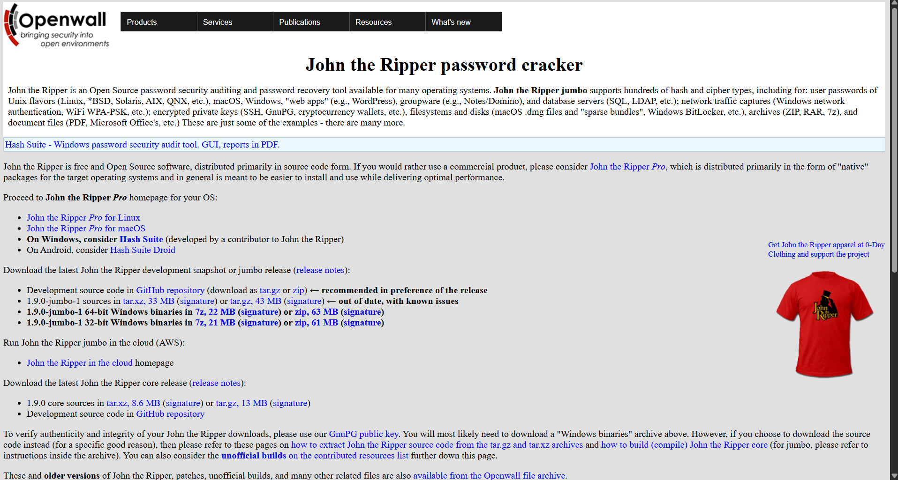
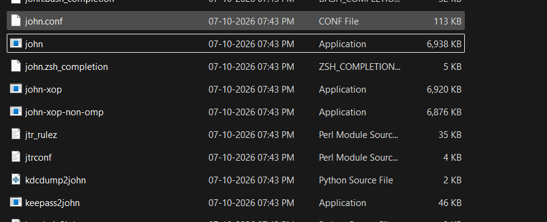
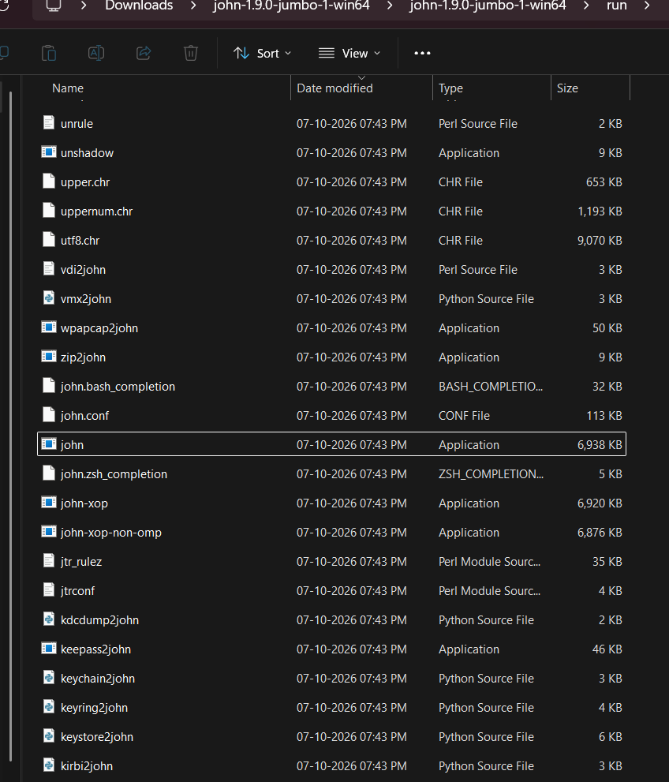
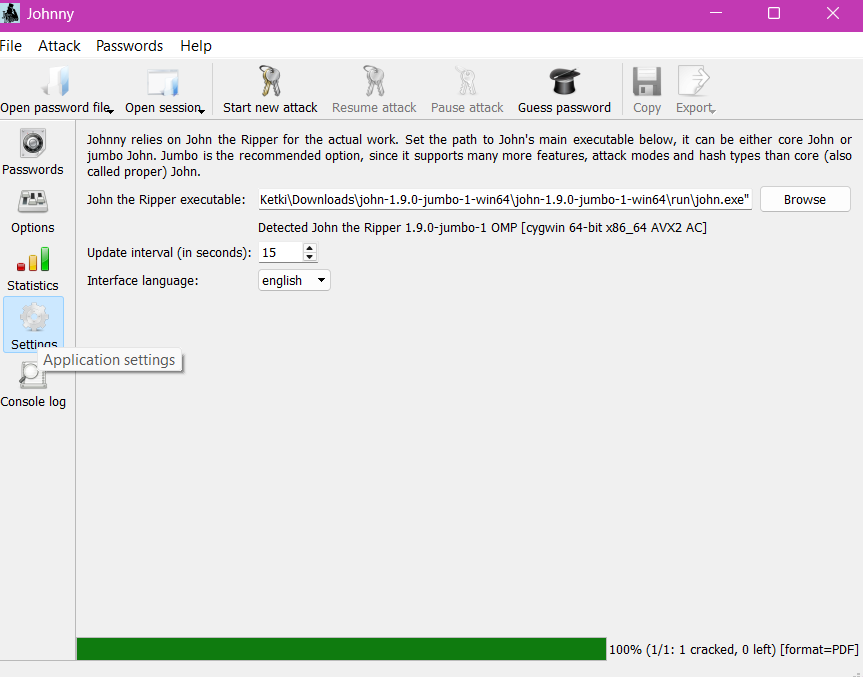
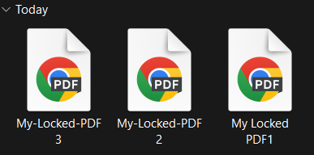
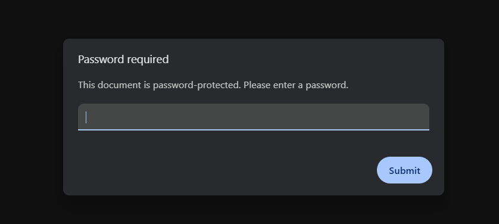
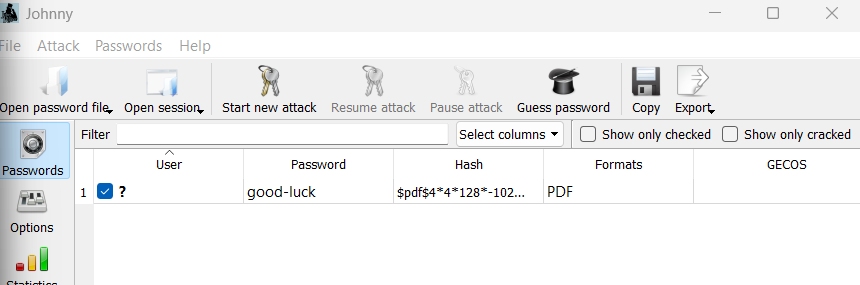
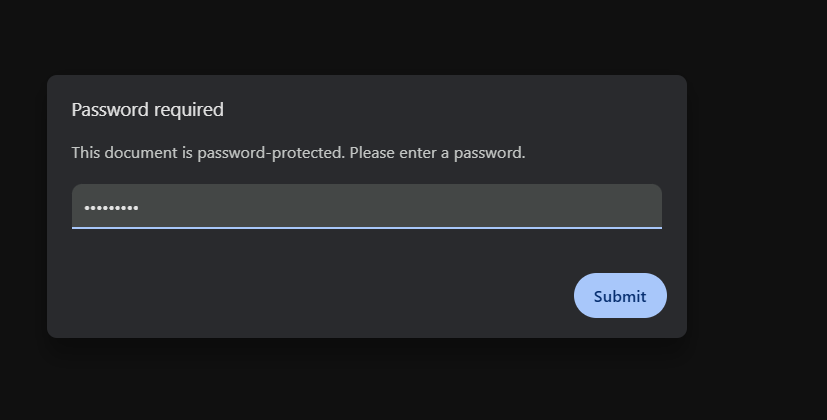
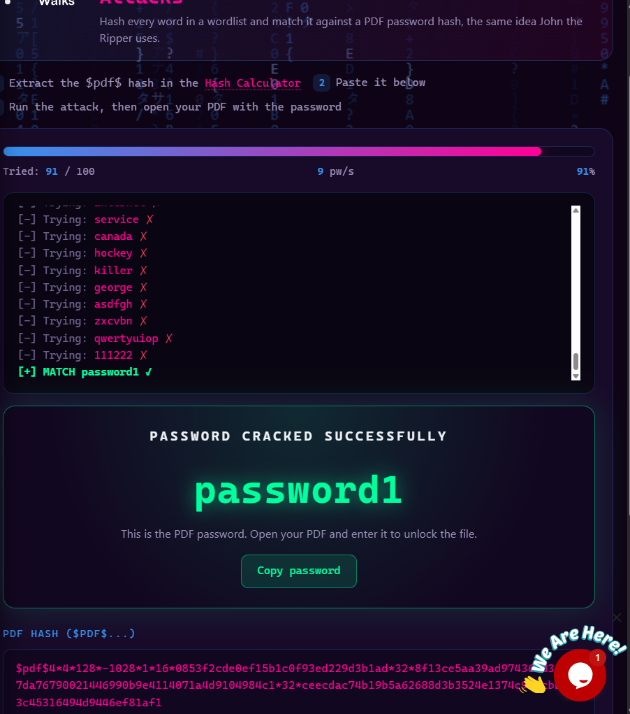

🔐 Week 3 — Password Cracking & Password Recovery

Password Recovery of a Password-Protected PDF using John the Ripper and Johny

  
  
  
  
  
  
  
  
  

## 📌 Project Overview

This Week 3 project focuses on password recovery and password security testing using John the Ripper and its graphical interface Johny.

The practical involved installing John the Ripper on Windows, configuring Johny with the John the Ripper executable, preparing an authorized password-protected PDF for testing, and performing password recovery using the generated password hash.

The purpose of the activity was to understand how password-cracking tools work and why strong passwords are important for protecting sensitive files.

## 🎯 Objectives

The main objectives of this project are to:

- Install and configure John the Ripper on Windows.
- Understand the purpose of password-cracking tools.
- Install and configure Johny as a graphical interface.
- Locate and configure the `john.exe` executable.
- Prepare a password-protected PDF for authorized testing.
- Extract the password hash from the PDF.
- Perform password recovery using John the Ripper.
- Verify the recovered password by opening the protected PDF.
- Understand the importance of strong passwords.
- Document the process, observations, and results.

## 🛡️ Scope & Ethical Use

All password recovery activities in this project were performed only on files that I owned or had explicit authorization to test.

The password-protected PDF was used as an educational test file for demonstrating password recovery techniques.

⚠️ Important: Password-cracking tools should only be used on files, accounts, systems, or data where appropriate authorization has been provided. Unauthorized password recovery or access may violate laws, policies, and organizational rules.

## 🧩 Module 1 — John the Ripper

### 🔎 What is John the Ripper?

John the Ripper is a password security auditing and password recovery tool.

It can test password hashes against different password candidates and techniques. It is commonly used by security professionals to evaluate password strength and identify weak passwords in authorized environments.

## 🛠️ Tools Used

| 🧰 Tool | 🎯 Purpose |
|---|---|
| John the Ripper | Password recovery and password security testing |
| Johny | Graphical interface for John the Ripper |
| PDF file | Authorized password-protected test file |
| Windows | Operating environment |

## 🪜 Installation & Configuration Procedure

### Step 1. Download John the Ripper

John the Ripper Jumbo was downloaded for Windows.

The downloaded archive was extracted to the local system.

📸 Evidence

### Step 2. Locate the John the Ripper Folder

After extraction, the John the Ripper folder was opened.

The `run` directory contains the main John the Ripper executable and supporting files.

The executable used for configuration is:

`john.exe`

📸 Evidence

### Step 3. Locate `john.exe`

Inside the `run` directory, the following executable was identified:

`john.exe`

The file was identified as an Application file.

📸 Evidence

### Step 4. Configure Johny

Johny was opened and the John the Ripper executable was configured.

The `john.exe` file located inside the `run` directory was selected.

The executable path was then provided to Johny.

📸 Evidence

### Step 5. Verify Johny Configuration

After selecting the correct `john.exe`, the configuration was checked to ensure that Johny could detect the John the Ripper executable correctly.

📸 Evidence

## 📄 Module 2 — Password-Protected PDF

### Step 1. Prepare the Test PDF

A password-protected PDF was prepared for the practical.

The PDF was used only as an authorized test file.

📸 Evidence

### Step 2. Verify PDF Protection

The PDF was opened to confirm that a password was required before the contents could be accessed.

📸 Evidence

## 🔐 Module 3 — PDF Password Hash

### Step 1. Extract the PDF Hash

The password-protected PDF was processed to obtain the password hash required for password recovery testing.

The extracted hash was saved for use with John the Ripper.

📸 Evidence

### Step 2. Load the Hash

The generated PDF hash was provided to John the Ripper for password recovery testing.

📸 Evidence

## 🔓 Module 4 — Password Recovery

### Step 1. Start Password Recovery

John the Ripper was used to test password candidates against the extracted PDF password hash.

The recovery process was monitored to determine whether the correct password could be identified.

📸 Evidence

### Step 2. Recovered Password

After the recovery process completed successfully, the recovered password was displayed by John the Ripper.

📸 Evidence

### Step 3. Verify the Password

The recovered password was entered into the password-protected PDF.

The PDF opened successfully, confirming that the recovered password was correct.

📸 Evidence

## 🖥️ Module 5 — Password Recovery using Hashcalculator

Hashcalculator is Networkwalk's own tool for password cracking, it was used to crack the password which tetsed against a word list of its own.

📸 Evidence

## 📊 Findings & Risk Analysis

| # | 🔎 Finding | 🧾 Observation | 🎯 Potential Impact | ⚠️ Risk Level |
|---|---|---|---|---|
| 1 | Weak password | The test password was successfully recovered | Weak passwords may be susceptible to password recovery attacks | 🟠 Medium |
| 2 | Password-protected PDF | The PDF required authentication before opening | Provides protection against unauthorized access when a strong password is used | 🟢 Low |
| 3 | Password recovery tools | John the Ripper was able to test password candidates against the hash | Demonstrates the importance of strong passwords | 🟠 Medium |
| 4 | GUI-based password testing | Johny provided a graphical interface for interacting with John the Ripper | Makes password security testing easier to understand and operate | 🟢 Low |

Note: These findings are observations from an authorized educational password recovery exercise and do not represent exploitation of an unauthorized system or file.

## 🛡️ Security Recommendations

Based on the observations from this activity:

### Use Strong Passwords

Passwords should be sufficiently long and difficult to guess.

### Avoid Common Passwords

Common words, simple patterns, names, and predictable combinations should be avoided.

### Use Unique Passwords

Different passwords should be used for different files and accounts.

### Protect Sensitive Documents

Sensitive PDF documents should be protected using strong passwords and appropriate encryption.

### Do Not Share Passwords

Passwords protecting confidential documents should not be unnecessarily shared with others.

### Use Password Managers

Password managers can help generate and securely store strong and unique passwords.

### Perform Authorized Security Testing

Password auditing tools should only be used on systems and files where appropriate authorization has been provided.

## 🧠 What I Learned

Through this Week 3 project, I learned how password recovery tools can be used for authorized password security testing.

 1. John the Ripper
 2. Johny
 3. `john.exe` Configuration
 4. Password Hashes
 5. Password Recovery
 6. Password Security
 7. Ethical Password Testing

    
## 🧠 Problems faced by me
I didn't extract the run folder of John application hence while enterign the path of 'john.exe', I got error of the path shown below. I solved the issue by extracting the file first and then passing it, it was accepted later.

📸 Evidence

## 🔗 Tools & Resources

John the Ripper: https://www.openwall.com/john/

John the Ripper Jumbo: https://github.com/openwall/john

## 👤 Author

Parul Bhople

Cybersecurity Intern, Networkwalks

## 📌 Project Information

Program Name: Cybersecurity Program at Networkwalks | Week: 03 | Project: Password Recovery using John the Ripper and Johny | Repository: GitHub
